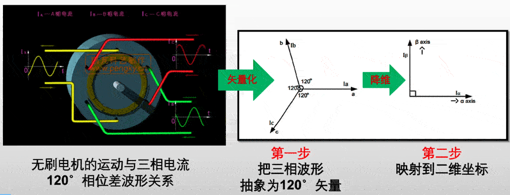
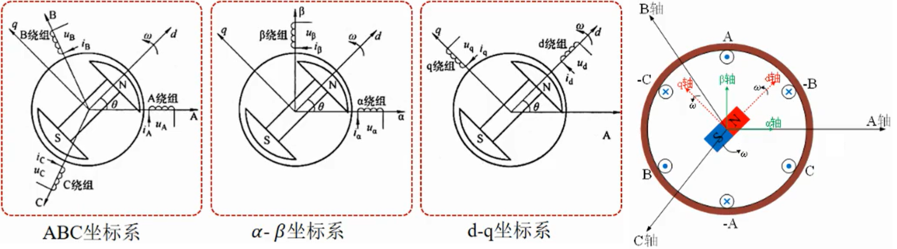
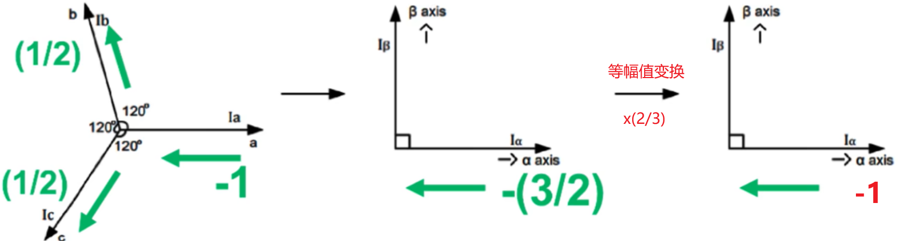
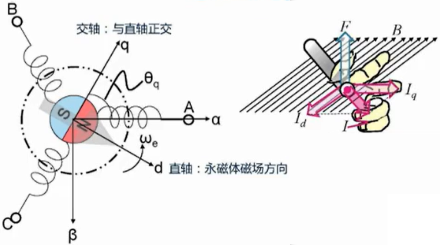
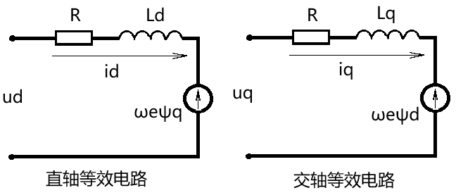
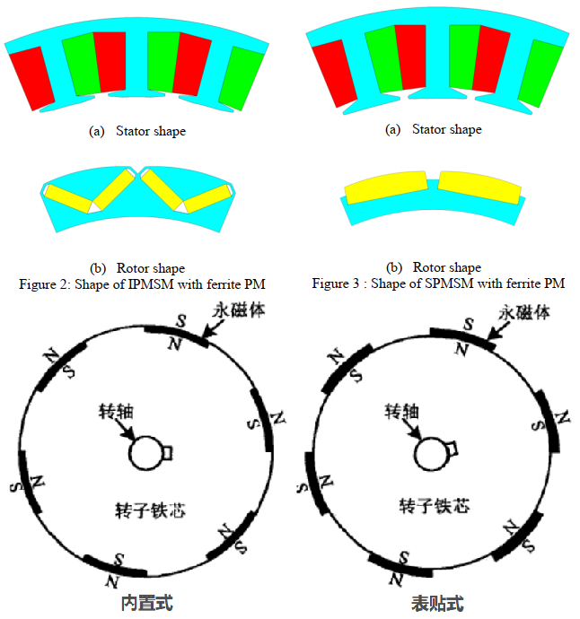
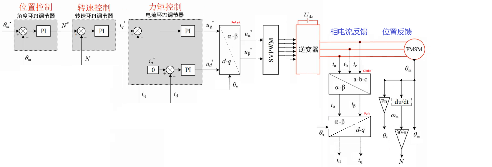

# FOC核心概念与价值

**磁场定向控制 Field-Oriented Control (FOC)**，又称**矢量控制 Vector Control (VC)**，是一种通过精确控制电机磁场方向和大小，实现转矩与励磁解耦的高性能交流电机控制技术，广泛应用于永磁同步电机 (PMSM)、无刷直流电机 (BLDC) 和感应电机 (IM)。

## 核心思想

将三相交流电机的复杂控制**等效为直流电机的简单控制**：通过坐标变换，把耦合的三相交流量分解为两个独立的直流分量（d 轴：励磁分量，q 轴：转矩分量），实现转矩与磁场的**完全解耦**控制。

## 关键优势

|       优势       |           具体表现           |       适用场景       |
| :--------------: | :--------------------------: | :------------------: |
| **转矩脉动极低** |   降至 1% 以下，运行更平稳   | 精密仪器、机器人关节 |
|  **动态响应快**  | 提升约 40%，快速启停与加减速 | 伺服系统、工业自动化 |
|    **效率高**    |     提高 8-12%，能耗降低     |   新能源汽车、家电   |
|  **控制精度高**  |  电流 / 速度 / 位置精准调节  |  数控机床、医疗设备  |
|    **低噪声**    |    正弦波驱动，电磁噪声小    |   对噪声敏感的环境   |

**电角度 $\theta_e$**

电角度 = 机械角度 \* 磁极对数

机械角度：电机转子在空间中的实际角度。

极数：电机的磁极数，磁极分为 N 极和 S 极，磁极数一般成对出现.

极对数：将一个 N 极和一个 S 极称为一对磁极，也就是极对数为 1.

> 极对数的检测：将三相电机的一相接入示波器中，旋转一圈电机，将其作为发电机使用，观察示波器的曲线，出现几次波峰即为几的极对数（转子切割了几次定子的磁感线）

# FOC核心数学基础与坐标变换

## 1. 坐标系定义

- **ABC 坐标系**：三相静止坐标系（电机定子绕组自然坐标系）
  分别以A、B、C三相定子线圈绕组通电之后产生的磁场方向 (右手螺旋定则) 作为 A、B、C轴 (120°相位差)，建立的坐标系
  三相定子电流与定子磁场之间没有直接的联系，无法通过自然坐标系的电机模型获得所需的电磁转矩矢量
- **αβ 坐标系**：两相静止坐标系（Clark 变换结果）
  将 $\alpha$ 轴固定在A轴上， $\beta$ 轴与之正交，建立的坐标系
  为定子线圈的坐标系，**随定子固定不动** 
- **dq 坐标系**：两相旋转坐标系（Park 变换结果，与转子同步旋转），d 轴与转子磁链方向 (N极) 一致，q 轴滞后 d 轴 90° 电角度
  为转子磁场的坐标系，**随转子旋转** ，dq 坐标系相对于αβ 坐标系的旋转的角度，为旋转的电角度

## 2. 核心坐标变换公式

### 2.1 Clark 变换（三相→两相静止）

将三相电流 (Ia, Ib, Ic) 转换为两相静止电流 (Iα, Iβ)：

 $ (方程组)
  \left\{\begin{array}{c}
      I_\alpha = i_a -\frac{1}{2} i_b -\frac{1}{2} i_c \\
      I_\beta = \frac{\sqrt{3}}{2} i_b -\frac{\sqrt{3}}{2} i_c
  \end{array}\right. $ 

$ (矩阵)
  \begin{bmatrix}
      I_\alpha \\
      I_\beta
  \end{bmatrix}
  =
  \begin{bmatrix}
      1 & -\frac{1}{2} &  -\frac{1}{2} \\
      0 & \frac{\sqrt{3}}{2} &  -\frac{\sqrt{3}}{2}
  \end{bmatrix}
  \begin{bmatrix}
      i_a \\
      i_b \\
      i_c
  \end{bmatrix} $ 

> **基尔霍夫电流定律**：$ i_a+i_b+i_c=0 $
>
> **等幅值形式**：为了使A轴电流 = α轴电流，乘以等幅值变换系数 $\frac{2}{3}$ 
>
>  
>
> **等功率形式**：等功率变换系数 $\sqrt{\frac{2}{3}}$

**等幅值形式**：

$ (方程组)
  \left\{\begin{array}{c}
      I_\alpha = \frac{2}{3} (i_a -\frac{1}{2} i_b -\frac{1}{2} i_c) \\
      I_\beta = \frac{2}{3} (\frac{\sqrt{3}}{2} i_b -\frac{\sqrt{3}}{2} i_c)
  \end{array}\right. $ 

$ (矩阵)
  \begin{bmatrix}
      I_\alpha \\
      I_\beta
  \end{bmatrix}
  =
  \frac{2}{3}
  \begin{bmatrix}
      1 & -\frac{1}{2} &  -\frac{1}{2} \\
      0 & \frac{\sqrt{3}}{2} &  -\frac{\sqrt{3}}{2}
  \end{bmatrix}
  \begin{bmatrix}
      i_a \\
      i_b \\
      i_c
  \end{bmatrix} $ 

### 2.2 Park 变换（两相静止→两相旋转）

将 (Iα, Iβ) 转换为与转子同步旋转的 (d, q) 坐标系，实现解耦。**$θ_e$ 为转子电角度**（由编码器或无感算法获取）：

$ (方程组)
  \left\{\begin{array}{c}
      i_d = i_\alpha cos\theta_e + i_\beta sin\theta_e \\
      i_q = -i_\alpha sin\theta_e + i_\beta cos\theta_e \\
  \end{array}\right. $ 

 $ (矩阵)
  \begin{bmatrix}
      i_d \\
      i_q
  \end{bmatrix}
  =
  \begin{bmatrix}
      cos\theta_e & sin\theta_e \\
      -sin\theta_e &  cos\theta_e
  \end{bmatrix}
  \begin{bmatrix}
      i_\alpha \\
      i_\beta
  \end{bmatrix} $ 

### 2.3 逆变换（旋转→静止→三相）

控制输出时需通过**逆 Park 变换**和**逆 Clark 变换**，将控制器输出的 (Vd, Vq) 转换为三相 PWM 信号：

**逆 Park 变换 RePark**：

$ (方程组)
  \left\{\begin{array}{c}
      i_\alpha = i_d cos\theta_e - i_q sin\theta_e \\
      i_\beta = i_d sin\theta_e + i_q cos\theta_e
  \end{array}\right. $ 

 $ (矩阵) 旋转矩阵
  \begin{bmatrix}
      i_\alpha \\
      i_\beta
  \end{bmatrix}
  =
  \begin{bmatrix}
      cos\theta_e & -sin\theta_e \\
      sin\theta_e &  cos\theta_e
  \end{bmatrix}
  \begin{bmatrix}
      i_d \\
      i_q
  \end{bmatrix} $ 

**逆 Clark 变换 ReClarke**

 $ (方程组) 
  \left\{\begin{array}{c}
      i_a = \frac{2}{3} I_{\alpha} \\
      i_b = \frac{-I_\alpha + \sqrt{3} I_\beta }{3} \\
      i_c = \frac{-I_\alpha -\sqrt{3} I_\beta }{3}
  \end{array}\right. $ 

$ (矩阵)
  \begin{bmatrix}
      i_a \\
      i_b \\
      i_c
  \end{bmatrix}
  =
  \begin{bmatrix}
      \frac{2}{3} & 0 \\
      -\frac{1}{3} &  \frac{\sqrt{3}}{3} \\
      -\frac{1}{3} &  -\frac{\sqrt{3}}{3}
  \end{bmatrix}
  \begin{bmatrix}
      I_\alpha \\
      I_\beta
  \end{bmatrix} $ 

**等幅值形式**：

 $ (方程组)
  \left\{\begin{array}{c}
      i_a = I_{\alpha} \\
      i_b = \frac{-I_\alpha + \sqrt{3} I_\beta }{2} \\
      i_c = \frac{-I_\alpha -\sqrt{3} I_\beta }{2}
  \end{array}\right. $ 

$ (矩阵)
  \begin{bmatrix}
      i_a \\
      i_b \\
      i_c
  \end{bmatrix}
  =
  \begin{bmatrix}
      1 & 0 \\
      -\frac{1}{2} &  \frac{\sqrt{3}}{2} \\
      -\frac{1}{2} &  -\frac{\sqrt{3}}{2}
  \end{bmatrix}
  \begin{bmatrix}
      I_\alpha \\
      I_\beta
  \end{bmatrix} $

# FOC数学模型（dq 坐标系）

电机本质上是一个能量转换装置，将电能转化成机械能或者将机械能转化成电能，建立电机的数学模型就是分析能量转换的过程，包括**磁场分析、电场分析和机械运动分析** 

FOC 控制的理论基础是建立在 dq 坐标系下的电机数学模型，核心包括**磁链方程、电压方程、转矩方程和运动方程**。

**基本思想**是将交流电动机等效为他励直流电动机，转矩和励磁分别做独立的控制

定子电流被分解为：

* 直轴电流id：励磁电流
* 交轴电流iq：转矩电流

> 增加id，则电机磁场增大；减小id，则电机磁场减小 (弱磁)
>
> 增加iq，则电机转矩增大；

 

**环路电压定律**：

 

根据转子上永磁体的位置不同，永磁同步电机可分为**内置式I-PMSM**、**表贴式SM-PMSM**

内置式的永磁体嵌入在磁导率较高的材料中，Q轴方向的磁导率大于D轴方向的空气气隙和与空气气隙磁导率差不多相同的永磁体的磁导率，因此Lq>Ld。而表贴式的DQ方向磁导率相同，因此Ld=Lq。

内置式：凸极特性，电感分量Ld < Lq ，转矩跟 id 、iq 有关

表贴式：隐极特性，电感分量Ld = Lq ，$T_e = \frac{3}{2} p_n \psi_f i_q $ ，转矩只跟 iq 有关

 

## 1.磁链方程

电流通过绕组产生的磁链，磁链为表征磁场强弱的物理量，磁链的变化率为电感两端的电压

$ \left\{
    \begin{array}{c}
        \psi_d = L_d i_d + \psi_f \\
        \psi_q = L_q i_q \\
    \end{array}
\right. $

$\psi_d$、$\psi_q$：直轴d、交轴q的磁链

$\psi_f$ --永磁体产生的磁链

Ld, Lq：d/q 轴电感（表贴式 PMSM 中 Ld≈Lq）

## 2.电压方程

 $ \left\{
    \begin{array}{c}
        u_d = R i_d + \frac{d}{dt} \psi_d - \omega_e \psi_q \\
        u_q = R i_q + \frac{d}{dt} \psi_q - \omega_e \psi_d \\
    \end{array}
\right. $ 

R--定子线圈电阻

ωe：电角速度 (ωe = p・ωm，p 为极对数，ωm 为机械角速度)

$\omega_e \psi_d$、$\omega_e \psi_q$：交叉耦合项，电机旋转时产生的反电动势 (反电动势 = 电角速度 x 磁链)，需在控制中补偿

$\frac{d}{dt} \psi_d$、$\frac{d}{dt} \psi_q$：直轴d、交轴q等效电路的电感的电压

## 3.电磁转矩方程

$T_e = \frac{3}{2} p_n [\psi_f i_q + i_d i_q (Ld -Lq)]$ 

$T_e$ --电机电磁转矩

$p_n$--电机磁极对数

$\frac{3}{2} p_n \psi_f i_q$ --永磁体的永磁转矩

$\frac{3}{2} p_n i_d i_q (Ld -Lq)$ --永磁体的磁阻转矩

转矩与电流的关系，可近似的：

$Torque(N*M) = 8.27 \frac{I_q(A)}{KV}$

其中，电机 Kv 值

## 4.机械运动方程

根据牛顿第二定律，电机角加速度 = 电机电磁转矩 - 负载转矩 - 摩擦阻力转矩

$J \frac{d \omega_m}{dt} = T_e - T_L - B \omega_m$ 

# FOC控制系统架构（三环控制）

 

**核心控制策略**：令**Id=0**（最大转矩电流比控制 MTPA），使转矩完全由 q 轴电流决定，实现类似直流电机的控制特性。

## 各环功能详解

### 1. 电流环（最内环，响应最快）

- **采样**：ADC 采集三相电流，经 Clark/Park 变换得到 Id/Iq
- **控制**：双 PI 控制器分别调节 Id 和 Iq，输出 Vd/Vq 电压指令
- **带宽**：通常 1-10kHz，决定系统快速性

### 2. 速度环（中间环）

- **反馈**：编码器或霍尔传感器获取电机转速
- **控制**：PI 控制器输出 q 轴电流指令（转矩指令）
- **带宽**：通常 100-1000Hz，决定速度稳定性

### 3. 位置环（最外环，精度最高）

- **反馈**：高精度编码器（如绝对值编码器）获取转子位置
- **控制**：PID 控制器输出速度指令
- **带宽**：通常 10-100Hz，决定定位精度

### 开环 Open-Loop Control：

不使用反馈系统来调整控制输入，基于预设要求输出一个固定控制信号

- 输入参数：Uq设定值、速度设定值（Speed_Ref）、位置设定值（Position_Ref）。
- 输出参数：PWM 波形的占空比或其他形式的电压指令。
- 根据速度设定值（Speed_Ref）、位置设定值（Position_Ref）计算出不断旋转的机械角度。Uq设定值 应尽量小，避免烧毁电机。

编码器无法直接测得电机转速 $\omega$ ，只能测得电机的位置(角度) $\theta$

用平均测速法，通过计算一定时间内的位置变化量来表示电机转速 (用**平均速度**代表**瞬时速度**)。适用于电机转速高时。

但在位置环控制时，电机转速很慢(转子固定在某个位置)，这时平均测速法存在很大的误差(转子不转或转的很慢，编码器没有输出或只有几个脉冲输出)。

所以可只使用**位置-力矩环**：此时位置环使用完整的**PID 控制**(位置的微分为速度，可减小震荡加快收敛；积分项可消除静态误差)

