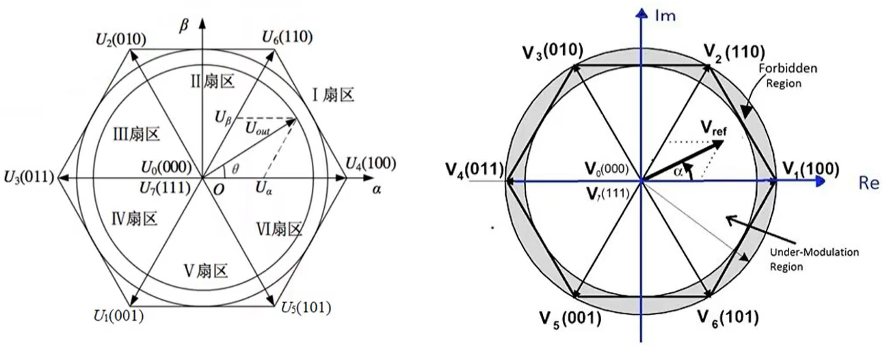
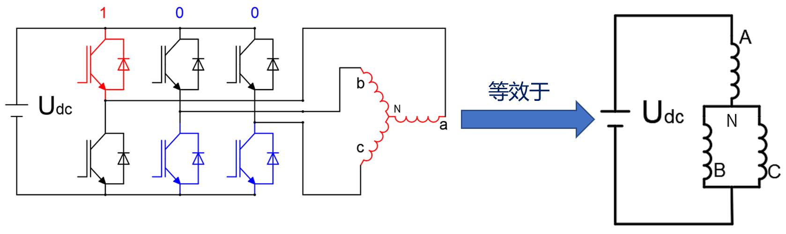
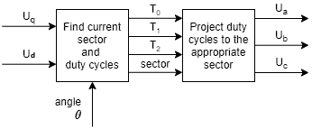
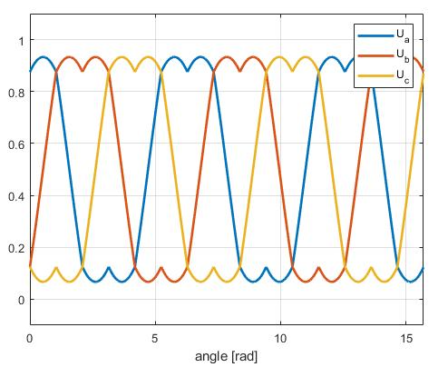

# SVPWM

Space Vector Pulse Width Modulation 空间电压矢量脉宽调制

## 基本原理

SVPWM 是 FOC 的核心执行环节，将 dq 坐标系的电压指令转换为逆变器的开关信号，相比 SPWM 具有**电压利用率高 (15.5%)、谐波含量低**的优势。

三相逆变器的6个开关元件可组成8个开关量模式，任意电压矢量可由最近的两个基本电压矢量合成，从而获得近似圆形的定子磁链，使输出的电压波形尽可能接近理想的正弦波形

理论基础：平均值等效原理

基于的坐标系： $\alpha\beta$ 坐标系

 

 

## 实现步骤

1. **电压矢量合成**：根据 αβ 电压指令，确定所在扇区和相邻基本电压矢量
2. **作用时间计算**：利用伏秒平衡原则，计算各基本矢量的作用时间
3. **PWM 波形生成**：按特定顺序切换逆变器开关，合成期望的空间电压矢量

## 扇区判断与矢量选择

- 将 αβ 平面分为 6 个 60° 扇区，根据 Vα/Vβ 符号和大小判断所在扇区
- 每个扇区使用相邻两个非零矢量和两个零矢量合成目标矢量
- 零矢量分配影响开关损耗和输出谐波

在SVPWM模式下，逆变器能输出的最大不失真圆形旋转电压矢量为正六边形的内切圆，其幅值为：$\frac{\sqrt3}{2} * \frac{2}{3} * U_{dc} = \frac{\sqrt3}{3} U_{dc} $

定义一个开关函数 $S_x(x = a、b、c)$

当 $S_a = 1$ 代表 a 相上桥臂导通， $S_a = 0$ 则下桥臂导通 (同一个半桥不可同时导通上下桥臂，否则短路)

共有8个开关量：

非零矢量 (6个) ： $[U_1(001)、U_2(010)、U_3(011)、U_4(100)、U_5(101)、U_6(110)]$ 

零矢量 (2个) ： $[U_0(000)、U_7(111)]$ 

> 分析 $U_4(100)$ ，电路状态：
>
>  
>
> 三相相电阻相等，即 $R_a = R_b = R_c$ 
>
> 根据串联分压定理，得相电压：
>
> $U_{aN} = \frac{2}{3} U_{dc}  \\
> U_{bN} = U_{cN} = - \frac{1}{3} U_{dc}$ 

其他情况的相电压：

| $S_a$ | $S_b$ | $S_c$ | 矢量符号 | $U_{aN}$               | $U_{bN}$               | $U_{cN}$               |
| ----- | ----- | ----- | -------- | ---------------------- | ---------------------- | ---------------------- |
| 0     | 0     | 0     | $U_0$    | 0                      | 0                      | 0                      |
| 0     | 0     | 1     | $U_1$    | $- \frac{1}{3} U_{dc}$ | $- \frac{1}{3} U_{dc}$ | $\frac{2}{3} U_{dc}$   |
| 0     | 1     | 0     | $U_2$    | $- \frac{1}{3} U_{dc}$ | $\frac{2}{3} U_{dc}$   | $- \frac{1}{3} U_{dc}$ |
| 0     | 1     | 1     | $U_3$    | $- \frac{2}{3} U_{dc}$ | $\frac{1}{3} U_{dc}$   | $\frac{1}{3} U_{dc}$   |
| 1     | 0     | 0     | $U_4$    | $\frac{2}{3} U_{dc}$   | $- \frac{1}{3} U_{dc}$ | $- \frac{1}{3} U_{dc}$ |
| 1     | 0     | 1     | $U_5$    | $\frac{1}{3} U_{dc}$   | $- \frac{2}{3} U_{dc}$ | $\frac{1}{3} U_{dc}$   |
| 1     | 1     | 0     | $U_6$    | $\frac{1}{3} U_{dc}$   | $\frac{1}{3} U_{dc}$   | $- \frac{2}{3} U_{dc}$ |
| 1     | 1     | 1     | $U_7$    | 0                      | 0                      | 0                      |

非零矢量的幅值相同，均为2/3Udc (参考链接： https://zhuanlan.zhihu.com/p/414721065)

  

 

找到目前转子所在象限；计算占空比时间 $T_0、T_1、T_2$ 
一个PWM周期： $T_0 + T_1 + T_2 = 1$ 

$s = \frac{3}{\pi} \theta + 1 \\
T_1 = \sqrt{3} sin(s \frac{\pi}{3} - \theta) \\
T_2 = \sqrt{3} sin(\theta - (s - 1) \frac{\pi}{3}) \\
T_0 = 1 - T_1 - T_2$ 

将 $T_0、T_1、T_2$ 的值投影到适当的占空比 $T_a、T_b、T_c$ 