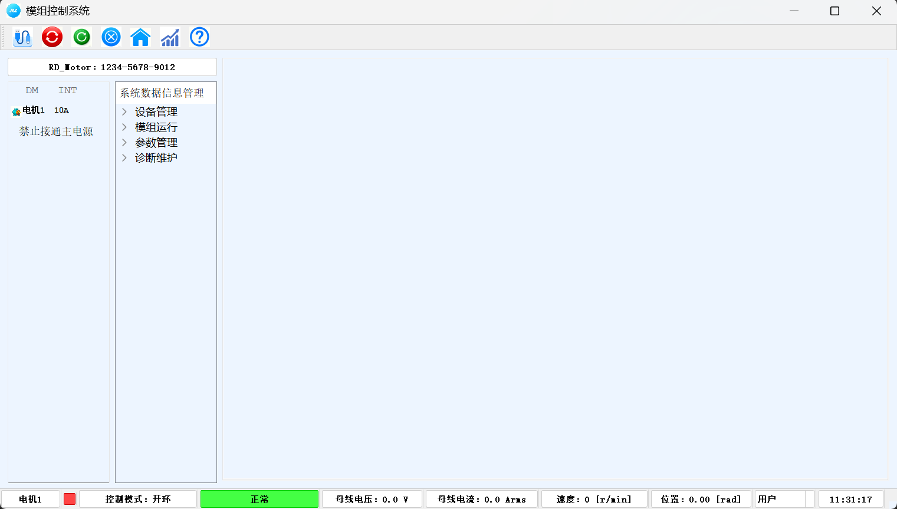
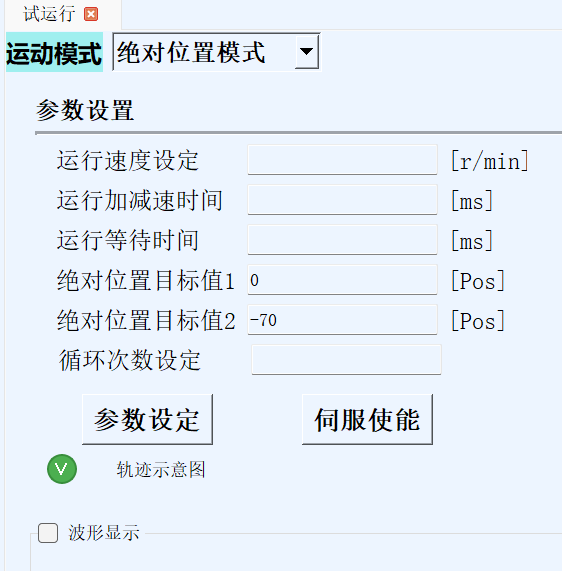
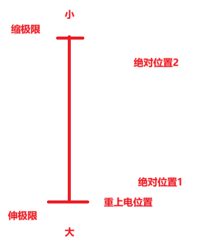

# 展示运动 上位机控制

# 展示运动启动步骤

源码：5.上位机控制 优化绝对位置 展示运动

1、接线

电源线

RS485线

2、开电源

48V

3、打开上位机，连接串口

MotorContor

 

4、试运行

 

设置好参数，点击参数设定，点击伺服使能，电机在绝对位置目标值1至绝对位置目标值2来回运动

当设置参数超出伸缩极限，将运行在伸缩极限(有效行程)

当设置参数在伸缩极限，将按设置参数位置运行

已在固件中定义好了伸极限(重上电位置)、缩极限，直线模组不可超出

向上运动时，靠近缩极限，此时可改绝对位置目标值1(伸的位置)

向下运动时，靠近伸极限，此时可改绝对位置目标值2(缩的位置)

**新的电机需要标定编码器方向、直线模组有效行程(从伸极限至缩极限的编码器读数范围)**

# 展示运动逻辑

 